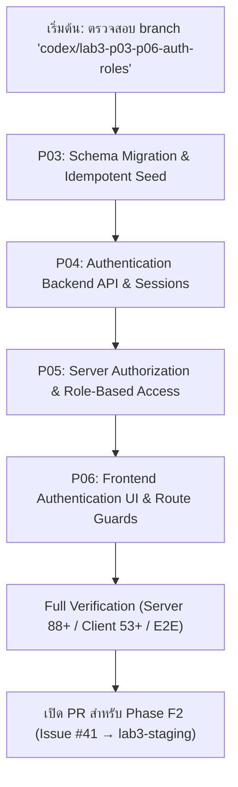

# TokTickIT Lab 3 — แผนงานและสรุปสถานะการทำงาน (Handoff to Phase F2)

เอกสารนี้จัดทำขึ้นเพื่อบันทึกสถานะงานที่ทำเสร็จในวันที่ 2026-09-17 และเป็นคู่มือเริ่มต้นทำงาน (Checklist & Implementation Guide) สำหรับการพัฒนา **Phase F2 (P03–P06)** ในวันพรุ่งนี้

---

## 1. สิ่งที่ทำเสร็จแล้วในวันนี้ (Completed Today: 2026-09-17)

### 1.1 Phase F1 (P00–P02) Baseline, Contracts & Harness Isolation
- **HARNESS-01 Isolation Guard ([server/src/harness-guard.ts](file:///c:/Users/uesr/Downloads/toktickit/server/src/harness-guard.ts)):**
  - พัฒนาระบบตรวจสอบความปลอดภัยของ Test Database (ห้ามชี้ dev/prod, บังคับ local test host, ตรวจชื่อ `_test`)
  - พัฒนาระบบตรวจสอบ Upload Directory (`hasPathOverlap` bidirectional check, ป้องกัน directory traversal, ห้ามใช้ root/dev/source directories)
  - พัฒนาระบบจอง Port อัตโนมัติ (API 3103, Client 5174) และ deterministic cleanup registry
- **แก้ไขข้อเสนอแนะ Peer Review ครบ 5 รอบ (Rounds 1–5):**
  - **Round 1:** ผูก guard เข้ากับ `setup-harness.ts` (Vitest) และ `e2e/global-setup.ts` (Playwright), ปรับ dynamic ports, แยก screenshots
  - **Round 2:** แก้ scope ตัวแปร `API_BASE_URL`, ซิงค์ environment ก่อนเริ่ม webServer, ตรวจจับ NTFS junctions/symlinks
  - **Round 3:** ส่งค่า DB fallback ให้ globalSetup, ป้องกัน parent path overlap (`server/`), เพิ่ม teardown cleanup ใน E2E, แยก screenshot ด้วย `<run-id>`
  - **Round 4:** ป้องกันการกลืน error ใน teardown (รวบรวม `cleanupErrors` + `uncleanedResources` แล้ว throw error), เรียก `$disconnect()` ใน `finally`, ดักจับ response ทันที
  - **Round 5:** สร้างคลาส `ResponseRegistrationTracker` เพื่อเก็บข้อผิดพลาดการอ่าน body เข้า `registrationErrors` แทน `catch {}`, เพิ่ม `test.afterEach` รอ registration ก่อนปิด page fixture, เพิ่ม Unit Regression Test ที่ทดสอบกับ helper คลาสจริง
- **ผลการรันชุดทดสอบจริงล่าสุด (Verified Real Results):**
  - **Server Suite:** `12 passed (12 test files), 88 passed (88 tests)` (Vitest exit code 0)
  - **Client Suite:** `10 passed (10 test files), 53 passed (53 tests)` (Vitest exit code 0)
  - **Playwright E2E:** `4 passed (4 tests, 19.1s)` (Playwright exit code 0)
  - **ยอดรวมการทดสอบ:** 145 tests ผ่าน 100%
- **Peer Review Approval & Merge PR #38:**
  - Peer Reviewer ตรวจรอบสุดท้ายและยืนยัน **Approved (ไม่มีการแก้ไขแล้ว)**
  - PR #38 ถูก Merge เข้าสู่ `lab3-staging` เรียบร้อยแล้ว (Merge Commit SHA: [`33624d0`](https://github.com/yuminnini/toktickit/commit/33624d0))
  - อัปเดตเอกสารปิดงาน [reviewer.md](file:///c:/Users/uesr/Downloads/toktickit/docs/lab-03/reviewer.md) และ [implementation-log.md](file:///c:/Users/uesr/Downloads/toktickit/docs/lab-03/implementation-log.md) สถานะเป็น `Completed / Passed` (Commit SHA: [`6ed8cef`](https://github.com/yuminnini/toktickit/commit/6ed8cef))

### 1.2 การเตรียมความพร้อมสำหรับ Phase F2
- **สร้าง GitHub Issue สำหรับ Phase F2:**
  - **Issue #41:** [Phase F2 (P03–P06): Migration, Authentication, Authorization & Auth UI](https://github.com/yuminnini/toktickit/issues/41)
- **สร้างและ Push Feature Branch ใหม่:**
  - **Branch:** `codex/lab3-p03-p06-auth-roles`
  - **Base:** `lab3-staging` (ซึ่งรวม F1 ไว้อย่างสมบูรณ์)
  - **สถานะ:** แตก branch และ push ขึ้น origin เรียบร้อย พร้อมเริ่มงานได้ทันที

---

## 2. แผนการดำเนินงานสำหรับวันพรุ่งนี้ (Phase F2: P03–P06)

ตามข้อตกลงของทีม เราจะ **พัฒนา Phase F2 ทั้งหมด (P03, P04, P05, P06) บน branch `codex/lab3-p03-p06-auth-roles` แล้วส่ง Pull Request เดียวเข้า `lab3-staging` เมื่อทั้งเฟสเสร็จสมบูรณ์**

ลำดับขั้นตอนที่จะเริ่มทำในวันพรุ่งนี้:



---

### Step 1: P03 — Database Migration & Idempotent Seed Data (AC-14–18)
1. **ปรับปรุง Prisma Schema ([server/prisma/schema.prisma](file:///c:/Users/uesr/Downloads/toktickit/server/prisma/schema.prisma)):**
   - เพิ่ม `enum Role { REQUESTER, IT_STAFF, IT_ADMIN }`
   - เพิ่มโมเดล `User`:
     - `id Int @id @default(autoincrement())`
     - `username String @unique`
     - `passwordHash String`
     - `name String`
     - `email String @unique`
     - `role Role @default(REQUESTER)`
     - `mustChangePassword Boolean @default(false)`
     - `isActive Boolean @default(true)`
     - `createdAt DateTime @default(now())`
     - `updatedAt DateTime @updatedAt`
     - ความสัมพันธ์กับ `Session` และ `Ticket`
   - เพิ่มโมเดล `Session`:
     - `id String @id` (UUID / token hash)
     - `userId Int`
     - `expiresAt DateTime`
     - `createdAt DateTime @default(now())`
   - คงความเข้ากันได้กับตาราง `Requester` หรือทำ data migration ย้ายข้อมูล Requester เดิมเข้าสู่ User
2. **สร้างและทดสอบ Migration:**
   - รัน migration บนฐานข้อมูลทดสอบ `toktickit_test`
   - ทดสอบทั้ง Fresh Database migration และ Populated Database migration (AC-14, AC-18)
3. **ปรับปรุง Seed Script ([server/prisma/seed.ts](file:///c:/Users/uesr/Downloads/toktickit/server/prisma/seed.ts)):**
   - ใส่รหัสผ่าน hash ด้วย `bcrypt`
   - กำหนดบัญชีทดสอบเริ่มต้น:
     - IT Admin: `admin` (รหัสผ่านเริ่มต้น)
     - IT Staff: `staff1`, `staff2`
     - Requesters: ย้ายจากรายชื่อเดิม (เช่น `janderson`, `mbrown`, etc.)
     - มีบัญชีอย่างน้อย 1 บัญชีที่ตั้งค่า `mustChangePassword: true`
   - รับประกันว่า Seed Script สามารถรันซ้ำได้โดยไม่เกิดข้อมูลซ้ำ (Idempotent)
4. **เขียนและรันชุดทดสอบ P03:**
   - ทดสอบ migration integrity และ seed idempotency ใน `server/tests/lab-03/`

---

### Step 2: P04 — Authentication Backend & Session Lifecycle (AC-01–02, AC-05–11)
1. **พัฒนา Auth Controller & Endpoints ([server/src/routes/auth.ts](file:///c:/Users/uesr/Downloads/toktickit/server/src/routes/auth.ts)):**
   - `POST /api/auth/login`: ตรวจสอบ username/password, สร้าง Session, ออก HttpOnly cookie (`SameSite=Lax`), ทำ session rotation
   - `POST /api/auth/logout`: ลบ Session ออกจากฐานข้อมูล และ clear cookie
   - `GET /api/auth/me`: ส่งคืนข้อมูลผู้ใช้งานปัจจุบัน (id, username, name, role, mustChangePassword)
   - `POST /api/auth/change-password`: ตรวจสอบรหัสผ่านเดิม, ตรวจสอบความปลอดภัยรหัสผ่านใหม่, อัปเดต hash, ปลด flag `mustChangePassword`, และ rotate session
2. **Security & Rate Limiting:**
   - ป้องกัน brute-force login ด้วย rate limiter
   - กำหนดอายุ session (Session Expiry)
3. **เขียน API Tests ([server/tests/lab-03/auth.api.test.ts](file:///c:/Users/uesr/Downloads/toktickit/server/tests/lab-03/auth.api.test.ts)):**
   - ทดสอบ login ผ่าน/ไม่ผ่าน, logout, session expiration, cookie attributes, change password

---

### Step 3: P05 — Server Authorization & Role-Based Access Control (AC-03–04)
1. **พัฒนา Middleware ([server/src/middleware/auth.ts](file:///c:/Users/uesr/Downloads/toktickit/server/src/middleware/auth.ts)):**
   - `authenticateSession`: ดึง session cookie, ค้นหา user, แนบเข้า `req.user`
   - `requireRole(...roles)`: ตรวจสอบสิทธิ์ตามบทบาท (Requester / IT Staff / IT Admin)
   - `requirePasswordChanged`: บล็อคไม่ให้เข้าถึง resource อื่นถ้ายังไม่เปลี่ยนรหัสผ่านเริ่มต้น
2. **ปรับปรุง Tickets & Attachments Endpoints:**
   - เปลี่ยนจากการอ่าน `requesterId` จาก query string/body มาเป็นการใช้ตัวตนจาก Session จริง
   - ป้องกันการ spoof requester ID
   - ปฏิบัติตาม Non-Disclosure Rule: การพยายามเข้าถึง ticket ของคนอื่นต้องตอบกลับ `404 Not Found`
3. **เขียน Integration Tests ([server/tests/lab-03/authz.api.test.ts](file:///c:/Users/uesr/Downloads/toktickit/server/tests/lab-03/authz.api.test.ts))**

---

### Step 4: P06 — Authentication UI, Route Guards & Shell Integration (AC-12–13)
1. **สร้าง Client State & Context ([client/src/context/AuthContext.tsx](file:///c:/Users/uesr/Downloads/toktickit/client/src/context/AuthContext.tsx)):**
   - จัดการสถานะ `user`, `isLoading`, ฟังก์ชัน `login()`, `logout()`, `refreshUser()`
2. **สร้างหน้า UI ใหม่:**
   - `LoginPage` (`/login`): ฟอร์มเข้าสู่ระบบ, แสดงข้อผิดพลาดชัดเจน, เข้าถึงได้ด้วยคีย์บอร์ด (Accessibility)
   - `ChangePasswordPage` (`/change-password`): ฟอร์มเปลี่ยนรหัสผ่านบังคับ
3. **ปรับปรุง Navigation & RouteGuard:**
   - อัปเดต `RouteGuard`: redirect ผู้ใช้ที่ยังไม่ล็อกอินไปที่ `/login` และ redirect ไปที่ `/change-password` หากมี flag บังคับ
   - ปรับปรุง Navbar: แสดงชื่อผู้ใช้ปัจจุบัน, Role Badge, ปุ่ม Logout
   - ตัดปุ่ม "Change Requester" เก่าออก
4. **เขียน UI Component Tests ([client/tests/lab-03/](file:///c:/Users/uesr/Downloads/toktickit/client/tests/lab-03/))**

---

### Step 5: Full Regression, เอกสาร และส่ง PR
1. รัน Full Suites ครบถ้วน:
   - `npm run test` (Server)
   - `npm run test` (Client)
   - `npx playwright test` (E2E)
2. อัปเดต [docs/lab-03/implementation-log.md](file:///c:/Users/uesr/Downloads/toktickit/docs/lab-03/implementation-log.md) และ [docs/lab-03/reviewer.md](file:///c:/Users/uesr/Downloads/toktickit/docs/lab-03/reviewer.md)
3. เปิด Pull Request จาก branch `codex/lab3-p03-p06-auth-roles` เข้าสู่ `lab3-staging` และส่งให้ Peer Reviewer ตรวจสอบ

---

## 3. สิ่งที่ต้องตรวจเช็คก่อนเริ่มเขียนโค้ดในวันพรุ่งนี้

เมื่อเปิดเครื่องและกลับมาในวันพรุ่งนี้ ให้ทำตามลำดับนี้:
1. อ่านไฟล์นี้: [docs/lab-03/NEXT-STEPS-F2.md](file:///c:/Users/uesr/Downloads/toktickit/docs/lab-03/NEXT-STEPS-F2.md)
2. ตรวจสอบ Git Branch:
   ```bash
   git status
   git branch
   ```
   (ต้องอยู่ที่ branch `codex/lab3-p03-p06-auth-roles` และ working tree สะอาด)
3. เริ่มต้นทำ **Step 1: P03 (Schema Migration & Seed)** ได้ทันที
