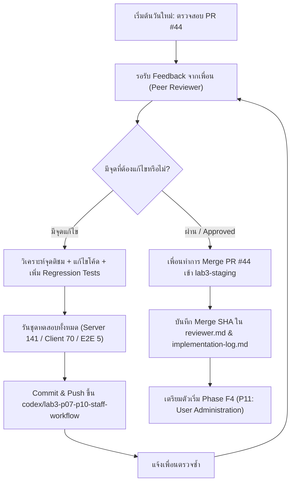

# TokTickIT Lab 3 — แผนงานและสรุปสถานะการทำงาน (Handoff to Phase F3 Review & Phase F4)

เอกสารนี้จัดทำขึ้นเพื่อบันทึกสถานะงานที่ทำเสร็จในวันที่ 2026-09-18 และเป็นคู่มือเริ่มต้นทำงาน (Checklist & Review Guide) สำหรับการดำเนินงานต่อในวันพรุ่งนี้

---

## 1. สิ่งที่ทำเสร็จแล้วในวันนี้ (Completed Today: 2026-09-18)

### 1.1 การปิดงาน Phase F2 (P03–P06)
- **แก้ไขข้อเสนอแนะ Peer Review Round 1 (7 จุด):**
  1. แก้ไข Seed ไม่ให้เขียนทับ ticket เดิม (แยก range เป็น `TKT-2026-900001`–`900024` พร้อม `update: {}`)
  2. แก้ไข Seed ให้คงสถานะ active และ role ของบัญชีเดิมที่มีอยู่แล้ว
  3. ป้องกันการหลบเลี่ยง Rate Limiting ด้วย `req.ip` แทน `X-Forwarded-For`
  4. เพิ่มการ provision บัญชีเก่าที่ยังไม่มีรหัสผ่าน ให้มีรหัสผ่านเริ่มต้นและ `mustChangePassword: true`
  5. ปรับกระบวนการเปลี่ยนรหัสผ่านเป็น atomic `$transaction` พร้อมเช็ค `sessionVersion` concurrency (409)
  6. ปรับการทำงานของ Logout ให้ rethrow database error เพื่อตอบ 500 อย่างถูกต้อง
  7. ปรับปรุง E2E tests ให้เข้าสู่ระบบผ่าน `/login` จริง ใช้ session cookies และส่ง CSRF tokens
- **แก้ไขข้อเสนอแนะ Peer Review Round 2 (2 จุด):**
  1. กำหนด `mustChangePassword: true` ให้ทุกบัญชีเริ่มต้นใน `seed.ts` (การบายพาสทำเฉพาะใน fixture ของ E2E เท่านั้น)
  2. ปรับ `authenticateSession` ให้แยกแยะกรณี "ไม่พบ session" ออกจาก "อ่าน DB ล้มเหลว" (ตอบ 500 ทันที)
- **Merge สำเร็จ:** เพื่อนทำการ Approve และ Merge [PR #42](https://github.com/yuminnini/toktickit/pull/42) เข้า `lab3-staging` (Merge SHA: [`edd8b16`](https://github.com/yuminnini/toktickit/commit/edd8b16))

---

### 1.2 การพัฒนาและส่งมอบ Phase F3 (P07–P10)
- **สร้าง Feature Branch และติดตาม Issue:**
  - **Issue #43:** [Phase F3: Staff Workflow (P07-P10)](https://github.com/yuminnini/toktickit/issues/43)
  - **Branch:** `codex/lab3-p07-p10-staff-workflow` (base มาจาก `lab3-staging` @ `edd8b16`)
- **P07: Requester Regression & Session Adaptation (T19–T22 / AC-19–AC-22):**
  - เชื่อมโยงตัวตน Requester กับ session (`req.user.id`) โดยสมบูรณ์ ไม่รับ `requesterId` จากภายนอก
  - รักษาสัญญา DTO ทั้งหมด: `ticketNumber`, alias `ticketNo`, ค่าสถานะ `active`, และฟิลด์ข้อมูลไฟล์แนบ
  - รักษา 404 non-disclosure บน ticket ของคนอื่น, 404 เมื่อโหลดไฟล์ที่ถูกลบ, และ 409 เมื่อลบไฟล์ซ้ำ
  - ชุดทดสอบ [`requester-regression.api.test.ts`](file:///c:/Users/uesr/Downloads/toktickit/server/tests/lab-03/requester-regression.api.test.ts) ผ่านครบ 4/4 ข้อ
- **P08: Staff Queue Backend & UI (T23–T27 / AC-23–AC-27 / QUEUE-UI):**
  - พัฒนา `GET /api/staff/tickets` รองรับค้นหา (summary, description, ticketNumber, requester name/email), ตัวกรอง (status, itPriority, category, unassignedOnly, assignedToMe), และการแบ่งหน้า (page, pageSize 10/25/50/100)
  - พัฒนา `GET /api/staff/eligible-owners` ดึงรายชื่อเจ้าหน้าที่ IT ที่ active เรียงตามชื่อ
  - สร้างหน้า [`StaffQueuePage.tsx`](file:///c:/Users/uesr/Downloads/toktickit/client/src/pages/StaffQueuePage.tsx) รองรับ Responsive (ตาราง Desktop / การ์ด Mobile, แถบตัวกรอง, ค้นหาพร้อมปุ่มรีเซ็ต, pagination, loading skeleton, empty states)
  - ชุดทดสอบ [`StaffTicketQueue.test.tsx`](file:///c:/Users/uesr/Downloads/toktickit/client/tests/lab-03/StaffTicketQueue.test.tsx) (5/5) และ [`staff-queue.api.test.ts`](file:///c:/Users/uesr/Downloads/toktickit/server/tests/lab-03/staff-queue.api.test.ts) (5/5) ผ่านทั้งหมด
- **P09: IT Staff Ticket Operations & Concurrency Control (T28–T33 / AC-28–AC-33):**
  - พัฒนา `GET /api/staff/tickets/:id` ส่งคืนรายละเอียดตั๋วพร้อมข้อมูลผู้ขอและประวัติ
  - พัฒนา `POST /claim`: รับเป็นเจ้าของตั๋วที่ยังว่าง (หากมีคนรับแล้วตอบ 409 `TICKET_ALREADY_ASSIGNED`)
  - พัฒนา `PATCH /owner`: โอนตั๋วให้เจ้าหน้าที่ IT ที่ active (ปฏิเสธคนนอก/inactive ด้วย 400)
  - พัฒนา `PATCH /priority`: ปรับ IT Priority โดยล็อก `requestedPriority` ไม่ให้เปลี่ยน
  - พัฒนา `PATCH /status`: ตรวจสอบ 8 สถานะตาม state transition matrix อย่างเคร่งครัด
  - ควบคุม Concurrency ด้วย Optimistic Locking (`version`) ตอบ 409 `VERSION_CONFLICT` พร้อมคืน state และ version ล่าสุด
  - รับประกันว่าทุกการเปลี่ยนแปลง commit ลงฐานข้อมูลก่อนส่ง HTTP response ออกไป
  - สร้างหน้า [`StaffTicketDetailPage.tsx`](file:///c:/Users/uesr/Downloads/toktickit/client/src/pages/StaffTicketDetailPage.tsx) พร้อม Action Panel, Transition Modal, Concurrency Conflict Banner
  - ชุดทดสอบ [`staff-ticket-detail.api.test.ts`](file:///c:/Users/uesr/Downloads/toktickit/server/tests/lab-03/staff-ticket-detail.api.test.ts) ผ่าน 6/6 ข้อ
- **P10: Communications, Internal Notes & Requester Indication (T34–T38 / AC-34–AC-38 / MSG-01):**
  - พัฒนา `POST /appears-resolved`: Requester ส่งสัญญาณว่าปัญหาคลี่คลายแล้วโดยไม่เปลี่ยนสถานะทางการ (idempotent, บันทึก actor และ timestamp)
  - ความคิดเห็นสาธารณะ (`GET`/`POST /comments`): Requester เจ้าของตั๋วและ Staff โพสต์ได้, Admin อ่านได้อย่างเดียว
  - บันทึกภายใน (`GET`/`POST /internal-notes`): Staff และ Admin เท่านั้น ซ่อนจาก Requester อย่างสมบูรณ์ (403/404)
  - บังคับใช้ Append-Only: ปฏิเสธ `PUT`, `PATCH`, `DELETE` ด้วย 405 `METHOD_NOT_ALLOWED` พร้อม Header `Allow: GET, POST`
  - ตรวจสอบความยาว 1–2000 ตัวอักษร, ตัดช่องว่างหัวท้าย, ปฏิเสธการปลอมแปลง author/timestamp, และแสดงผลข้อความอย่างปลอดภัย
  - สร้างคอมโพเนนต์ [`PublicCommentsSection.tsx`](file:///c:/Users/uesr/Downloads/toktickit/client/src/components/PublicCommentsSection.tsx), [`InternalNotesSection.tsx`](file:///c:/Users/uesr/Downloads/toktickit/client/src/components/InternalNotesSection.tsx) และ "Problem Appears Resolved" modal ใน [`TicketDetail.tsx`](file:///c:/Users/uesr/Downloads/toktickit/client/src/pages/TicketDetail.tsx)
  - ชุดทดสอบ [`comments-notes.api.test.ts`](file:///c:/Users/uesr/Downloads/toktickit/server/tests/lab-03/comments-notes.api.test.ts) ผ่าน 5/5 ข้อ
- **E2E Flow Integration (T39 / AC-39):**
  - สร้าง [`e2e/lab-03/staff-ticket-flow.spec.ts`](file:///c:/Users/uesr/Downloads/toktickit/e2e/lab-03/staff-ticket-flow.spec.ts) ทดสอบครบวงจร: ล็อกอิน Staff -> ค้นหาตั๋วในคิว -> เข้าหน้ารายละเอียด -> Claim ตั๋ว -> ตั้ง IT Priority -> ใส่ Comment สาธารณะและ Note ภายใน -> เปลี่ยนสถานะเป็น IN_PROGRESS และ RESOLVED สำเร็จอย่างสมบูรณ์
- **ผลการทดสอบจริง (Real Verification Evidence):**
  - **Server Vitest:** 21 test files, **141 tests passed** (100% pass)
  - **Client Vitest:** 13 test files, **70 tests passed** (100% pass)
  - **Playwright E2E:** 3 test files, **5 tests passed** (100% pass)
  - **Client Build (`tsc && vite build`):** 0 errors
  - **Server Build (`tsc`):** 0 errors
- **เปิด Pull Request และส่งตรวจ:**
  - อัปเดต [implementation-log.md](file:///c:/Users/uesr/Downloads/toktickit/docs/lab-03/implementation-log.md) และ [reviewer.md](file:///c:/Users/uesr/Downloads/toktickit/docs/lab-03/reviewer.md)
  - Commit [`df12f8a`](https://github.com/yuminnini/toktickit/commit/df12f8a) และ [`d6dc61f`](https://github.com/yuminnini/toktickit/commit/d6dc61f)
  - เปิด **[PR #44 — feat(staff): Phase F3 Staff Queue, Operations & Communications (#43)](https://github.com/yuminnini/toktickit/pull/44)** เข้า `lab3-staging` เรียบร้อย

---

## 2. แผนการดำเนินงานสำหรับวันพรุ่งนี้ (Next Steps for Tomorrow)



---

### ขั้นตอนที่ 1: รับ Feedback จากเพื่อนที่รีวิว Phase F3 (PR #44)
1. เมื่อเพื่อนส่งผลการตรวจรีวิวมา ให้คัดลอกข้อความ feedback ของเพื่อนมาวางในห้องแชทได้ทันที
2. ระบบจะจัดกลุ่มข้อเสนอแนะตามระดับความสำคัญ (เช่น P1: บัคกระทบ flow/database/security, P2: edge cases/concurrency/validation)
3. ตรวจสอบโค้ดในจุดที่เพื่อนระบุและวางแผนแก้ไขตามสัญญา Lab 3 อย่างแม่นยำ

### ขั้นตอนที่ 2: ดำเนินการแก้ไขและทดสอบซ้ำ (Iterative Resolution)
1. แก้ไขไฟล์ที่เกี่ยวข้องบน branch `codex/lab3-p07-p10-staff-workflow`
2. เพิ่ม Unit/Integration Test เพื่อป้องกันไม่ให้เกิด Regression ซ้ำ
3. รันชุดทดสอบยืนยันความถูกต้อง:
   ```bash
   npm --prefix server run test
   npm --prefix client test
   npx playwright test
   npm --prefix client run build
   npm --prefix server run build
   ```
4. ทำการ commit และ push ไปที่ `origin/codex/lab3-p07-p10-staff-workflow`
5. สรุปผลการแก้ไขพร้อม test evidence ส่งให้เพื่อนตรวจสอบอีกครั้ง

### ขั้นตอนที่ 3: เมื่อเพื่อนกด Approve และ Merge เข้า `lab3-staging`
1. บันทึก Merge Commit SHA ของ PR #44 ลงใน [reviewer.md](file:///c:/Users/uesr/Downloads/toktickit/docs/lab-03/reviewer.md) และ [implementation-log.md](file:///c:/Users/uesr/Downloads/toktickit/docs/lab-03/implementation-log.md)
2. อัปเดต local branch:
   ```bash
   git checkout lab3-staging
   git pull origin lab3-staging
   ```
3. สร้าง Issue และ Branch ใหม่สำหรับ **Phase F4 (P11: User Administration)**:
   - Branch แนะนำ: `codex/lab3-p11-user-admin`
   - Scope: หน้าจัดการบัญชีผู้ใช้งานสำหรับ Administrator (`/admin/users`), สร้างบัญชีใหม่, แก้ไขบทบาท (Role), และสลับสถานะเปิด/ปิดการใช้งาน (Active/Inactive)

---

## 3. สิ่งที่ต้องตรวจเช็คก่อนเริ่มงานในวันพรุ่งนี้

1. ตรวจสอบสถานะ Git:
   ```bash
   git status
   git branch
   ```
   (ควรอยู่ที่ branch `codex/lab3-p07-p10-staff-workflow` และ `working tree clean`)
2. เปิดดูสถานะ PR บน GitHub:
   - [Pull Request #44](https://github.com/yuminnini/toktickit/pull/44)
3. พร้อมรับข้อความ feedback จากเพื่อนเพื่อเริ่มวิเคราะห์และแก้ไขทันทีครับ
