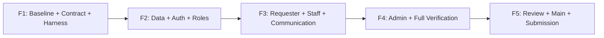

# Lab 3 — Pipeline 5 เฟสสำหรับ main ชุดนี้

สถานะเริ่มต้นของ implementation: **Planned ทั้งหมด**. เอกสารนี้เป็นร่างพร้อมใช้เริ่มพัฒนา
ไม่ใช่รายงานว่า Lab 3 เสร็จ และไม่รับช่วงสถานะ P02 In progress จากแพ็กตัวอย่าง

## เฟสใหญ่และเกณฑ์จบ

| เฟส | งานย่อย | งาน | Exit gate |
|---|---|---|---|
| F1 | P00–P02 | ตรวจฐานและเตรียม contract / test harness | Baseline ที่ตรวจจริง, contract ตรง main, AC mapping ครบ และ HARNESS-01 ผ่านก่อน DB/E2E |
| F2 | P03–P06 | Migration / Authentication / Authorization / Auth UI | Migration fresh+populated และ seed ซ้ำผ่าน; session/forced change/RBAC/UI ผ่าน; reviewer ตรวจ |
| F3 | P07–P10 | Requester regression / Staff Queue / Operations / Communication | Requester เดิมทำงานผ่าน session; Queue และ workflow/visibility/concurrency ผ่าน; reviewer ตรวจ |
| F4 | P11–P12 | Admin / Integrated verification | Admin safety ผ่าน; full suites, migration, security, responsive และ visual inspection มีหลักฐาน |
| F5 | P13–P14 | Review / Release / Submission | Review/merge จริง, ทดสอบ final main พร้อม SHA, PDF Answer Part 1–9 ครบ |

## งานย่อยและ dependency

| ID | เฟส | งาน | ต้องผ่าน | วิธีทำ | หลักฐานก่อนปิด |
|---|---|---|---|---|---|
| P00 | F1 | Baseline | ไม่มี | ตรวจ source manifest, Git จริง, scripts/schema/routes/DTOs/seed และ environment โดยไม่แก้ข้อมูล | baseline.md และ ADAPTATION-NOTES.md ยืนยันกับ checkout ปัจจุบัน |
| P01 | F1 | Specification | P00 | ทบทวน 4 contracts, role matrix, data mapping, API/validation/status matrix/UI และ 56 AC | contract draft ครบและมีหลักฐาน spec review ก่อน merge implementation |
| P02 | F1 | Test harness | P01 | แยก DB/uploads/API/client/workers; แก้ fallback env/hardcoded port/cleanup/screenshots; map AC | HARNESS-01 และ baseline regression รันปลอดภัย; เก็บผลจริง |
| P03 | F2 | Migration and seed | P02 | เพิ่ม User mapped to RequesterUser, session/roles/credentials/owner/priority/version/statuses/comments/notes | fresh/populated migration, ID/FK/bytes preservation, credential provisioning และ seed idempotent |
| P04 | F2 | Authentication backend | P03 | login/logout/me/change-password, hashing/session rotation/expiry/revocation/CSRF/rate limit | AC-01–02, AC-05–11 ผ่านทั้ง positive/negative/boundaries |
| P05 | F2 | Server authorization | P04 | ใช้ session ทุก protected route; ignore spoofed requesterId; แยก ownership/RBAC/forced-change | AC-03–04 และ matrix ทุกบทบาทผ่าน direct API; foreign resource 404 |
| P06 | F2 | Authentication UI | P05 | Login/ChangePassword/AuthContext/route guards/nav/logout; ล้าง requester selector state | AC-12–13 และ account-switch isolation; ไม่มี Change Requester |
| P07 | F3 | Requester regression | P06 | adapt create/list/detail/attachment calls และ tests ให้ใช้ session; รักษา DTO/validation/query เดิม | AC-19–22 ผ่าน; migration legacy fixture เข้าถึงได้เฉพาะเจ้าของ |
| P08 | F3 | Staff Queue | P07 | เพิ่ม staff queue API + responsive table/cards, search/filter/sort/paging/feedback | AC-23–28 ผ่าน; deterministic ordering และแยก empty/no-results |
| P09 | F3 | Staff operations | P08 | claim/reassign/IT Priority/status matrix/expectedVersion และ confirmation | AC-29–33 ผ่าน; concurrent race มีผู้ชนะเดียวและ stale 409 |
| P10 | F3 | Comments and notes | P09 | append-only public comments/internal notes/appears-resolved พร้อม author/time ฝั่ง server | AC-34–39 ผ่าน; Requester ไม่เห็น notes และไม่เปลี่ยน formal status |
| P11 | F4 | User administration | P10 | simple list/search/role filter/create/edit/reset/active safety/owner unassignment | AC-40–49 ผ่าน รวม concurrent last-admin protection และ session revocation |
| P12 | F4 | Integrated verification | P11 | unit/API/UI/style/security/migration/E2E/regression, 375/768/1024/1280 และตรวจภาพจริง | AC-50–53 และทุก product AC มีผล; ไม่มี skip ที่ซ่อน requirement |
| P13 | F5 | Review and release | P12 | รวบรวม Issue/PR/peer review; release lab3-staging → main แล้ว run suites บน SHA สุดท้าย | AC-55–56 ด้าน review/release; ห้ามใช้ผล feature branch แทน main |
| P14 | F5 | Submission | P13 | อัปเดต README/เอกสาร 6 ไฟล์และ PDF Answer Part 1–9, ตรวจลิงก์/ภาพ/ความตรง final main | AC-54–56, submission-checklist.md ครบและข้อมูลจริง |

## Workflow ต่อชุดงาน

1. เริ่ม Issue ที่มี scope/AC/planned tests/dependencies ชัดเจน; ตรวจของเดิมก่อนสร้างซ้ำเมื่อได้รับมอบหมายให้ทำ GitHub
2. ใช้ branch `codex/lab3-pNN-description`; ตรวจฐาน `lab3-staging` จาก repository จริง
3. Spec DD → Test DD → Red → Green → Refactor → regression; ไม่ใช้ build แทน behavioral test
4. เปิด PR เข้า `lab3-staging` เมื่อได้รับมอบหมายให้เปิด PR พร้อม scope/results/known gaps
5. ผูก Issue ด้วย Development panel และตรวจลิงก์จริงเมื่อ staging ไม่ใช่ default branch
6. Peer reviewer ตรวจ/ให้ feedback; ผู้ทำงานแก้; reviewer approve และ merge ตามทีมตกลง
7. Review ต่อเนื่องทุกเฟส; F5 รวบรวมหลักฐานและ reviewed release `lab3-staging` → `main`

5 เฟสไม่จำกัดว่าต้องมีเพียง 5 Issues/PRs. แบ่งตาม P00–P14 หรือชุดย่อยที่ review ได้
สถานะรายงานใช้ `F2 / P04 — In progress` พร้อม files/tests/next step
ถ้า dependency ไม่ผ่าน ให้แก้ต้นเหตุหรือระบุ Blocked; ไม่ข้ามไปอ้าง Done

## ตำแหน่งงาน

- ต่อแอปเดิม `server/src/`, `client/src/`; migration ใหม่ `server/prisma/migrations/`
- contracts/evidence `docs/lab-03/`; tests ใหม่ `server/tests/lab-03/`, `client/tests/lab-03/`, `e2e/lab-03/`
- screenshots ใหม่ `artifacts/lab-03/screenshots/<run-id>/`; raw logs `artifacts/lab-03/logs/<run-id>/`
- tests ใหม่ในแผนยังไม่ใช่ไฟล์ที่สร้างแล้ว; สร้างเมื่อถึงงานนั้น ไม่เติม placeholder tests เพื่อให้จำนวนครบ
